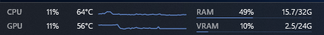

# Taskbar System Info

A compact, click-through system monitor for the far-left free area of the
Windows 11 taskbar. It is designed for a quick administrator glance: current
values show what is happening now, while two restrained history traces reveal
whether a CPU or GPU spike is momentary or sustained.



```text
CPU  10%  72°C  [60-second graph]    RAM   52%  16.7/32G
GPU   4%  56°C  [60-second graph]    VRAM   9%   2.1/24G
```

The fixed two-column layout keeps every metric in a predictable place. CPU and
GPU history uses a fixed 0-100% scale. RAM and VRAM use thin capacity bars.
Fixed-width fields prevent the layout from shifting as values change. Normal
values remain monochrome; only warning and critical readings receive color.

Network and disk activity are intentionally not collected.

Unlike the performance placeholders in
[Taskbar Clock Customization](https://github.com/ramensoftware/windhawk-mods/blob/main/mods/taskbar-clock-customization.wh.cpp),
this mod does not alter the clock. It uses the free far-left taskbar area for a
stable 2x2 dashboard with rolling graphs, capacity bars, temperature alerts and
fixed-width values.

## Metrics

- CPU utilization from `GetSystemTimes`.
- RAM usage and capacity from `GlobalMemoryStatusEx`.
- GPU utilization from Windows PDH GPU engine counters.
- Dedicated or shared GPU-memory usage from Windows PDH counters.
- GPU-memory capacity and adapter identity from live D3DKMT enumeration, with
  DXGI as a compatibility fallback. Shared system memory is used when an
  integrated adapter reports no dedicated video memory.
- CPU and GPU temperatures from HWiNFO when available.
- GPU fallback from the Windows display-driver interface (D3DKMT).
- CPU fallback from Windows ACPI thermal zones exposed through PDH.

Metric collection runs on a worker thread. The taskbar UI thread only renders
the latest completed snapshot. If a display-driver restart changes an adapter
LUID or invalidates the active performance counters, the mod refreshes the live
adapter list and rebuilds the counters automatically.

The adapter with the most dedicated VRAM is selected automatically. A partial
adapter-name filter is available for multi-GPU systems. GPU usage and VRAM are
matched to the selected live adapter by LUID. Duplicate stale adapters without
a driver name are ignored when a named adapter with the same capacity exists.

## Temperature providers

The **Temperature source** setting provides these modes:

- **Automatic** fills CPU and GPU independently: HWiNFO Shared Memory first,
  then HWiNFO Gadget Registry, then Windows D3DKMT for a still-missing GPU
  reading and Windows thermal zones for a still-missing CPU reading.
- **HWiNFO automatic** uses only the two HWiNFO interfaces.
- **HWiNFO Shared Memory** uses only `Global\HWiNFO_SENS_SM2`.
- **HWiNFO Gadget Registry** uses only
  `HKCU\Software\HWiNFO64\VSB`.
- **Windows native** reads GPU temperature from the selected display driver via
  D3DKMT and CPU temperature from the Windows
  `\Thermal Zone Information(*)\Temperature` PDH counter. It needs no
  third-party monitor.
- **Disabled** skips temperature collection while keeping every other metric.

Windows thermal zones are ACPI platform zones. Depending on the firmware they
can represent a motherboard, chassis, skin, or processor-related zone rather
than the CPU package itself. The optional instance-name filter selects specific
zones. The aggregation setting defaults to the average used by Taskbar Clock
Customization; **Hottest** is available for alert-oriented monitoring. Systems
that don't expose thermal zones simply fall through without blocking other
metrics.

HWiNFO is optional and is not bundled with this mod.

Shared-memory integration targets HWiNFO 7.0 or newer, which permits full
disclosure of the interface. The free HWiNFO64 edition disables shared memory
after 12 hours of continuous use; HWiNFO64 Pro has no such limit.

Gadget Registry is a separate HWiNFO interface. Enable **Report to Gadget**
under **Sensor Settings > HWiNFO Gadget**. HWiNFO and Explorer must run under
the same Windows user. The automatic sensor matcher prefers:

- CPU: `CPU (Tctl/Tdie)`, `CPU Die (average)`, or `CPU Package`.
- GPU: `GPU Temperature`.

Partial HWiNFO sensor-name filters are available in the mod settings.

If the selected source is unavailable, temperatures are shown as `--°C`; CPU,
GPU, RAM, and VRAM monitoring continues to work. The active CPU and GPU
providers are logged only when they change.

## Default alerts

| Metric | Warning | Critical |
| --- | ---: | ---: |
| CPU temperature | 75°C | 85°C |
| GPU temperature | 80°C | 90°C |
| RAM and VRAM | 80% | 90% |

Alerts use a small release margin to avoid flickering around a threshold. CPU
and GPU utilization stays in the normal text color because brief 100% spikes
are not automatically a problem.

## Compatibility and placement

- Windows 11 64-bit, primary taskbar. x64 is hardware-tested; ARM64 is
  compilation-tested.
- Centered taskbar icons are recommended.
- Enable **Reserve space before the Start button** if the widget overlaps
  left-aligned taskbar buttons.
- The widget is native XAML inside the taskbar, not a topmost overlay or XAML
  Diagnostics consumer.
- It can coexist with Taskbar Styler.

## Install

### From the official Windhawk catalog

Once accepted into the catalog, search for **Taskbar System Info** in Windhawk
and select **Install**.

### Manual installation

1. Open Windhawk and select **Create a new mod**.
2. Replace the generated source with `taskbar-system-info.wh.cpp`.
3. Select **Compile Mod** and enable it.

## Development and verification

Run from PowerShell:

```powershell
python .\tests\validate-source.py
.\build.ps1
.\tests\run-metrics-smoke.ps1
```

The local build uses the compiler bundled with Windhawk. The smoke-test queries
live D3DKMT, DXGI fallback and PDH state, verifies that the selected GPU LUID is
present in the performance counters, checks GPU, VRAM and temperature ranges,
and reports whether Windows exposes usable ACPI thermal zones.

## Credits and license

Taskbar discovery and window-thread marshaling follow techniques from
[Multirow taskbar for Windows 11](https://github.com/ramensoftware/windhawk-mods/blob/main/mods/taskbar-multirow.wh.cpp)
by Michael Maltsev (`m417z`). Native GPU temperature collection follows his
[Taskbar Clock Customization implementation](https://github.com/m417z/my-windhawk-mods/commit/861920df6380f4c13abec5d9226362c4725e8362).

Released under GPL-3.0.
