# Taskbar System Info

CPU, GPU, RAM and VRAM on the Windows 11 taskbar. Usage, temperatures and
history graphs stay in one widget. It adapts to the free space and taskbar
height, and you can drag it to another position or monitor.

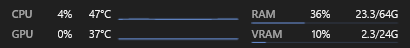

The images on this page use the mod's actual XAML widget and native move renderer.
The readings match a workstation snapshot: Ryzen 9 5900X, 64 GB RAM and Radeon
RX 7900 XTX with 24 GB VRAM. Graph history is illustrative. These are isolated
renders, not screenshots of a live Explorer session.

The widget shows CPU and GPU usage, their temperatures, and a history graph for
each. RAM and VRAM show the percentage, used/total capacity and a thin usage bar.
Values stay in fixed columns as the readings change. CPU/GPU fields are compact,
with six logical pixels of padding on each side of the widget.

When space is limited, the widget can hide graphs or memory details, or use one
row on a low taskbar. It restores the full view when space returns. No manual
mode switch is needed. See [Adaptive layouts](#adaptive-layouts) for examples.

Normal readings use the taskbar text color. Temperature and memory alerts add
color when a threshold is reached. Light, dark and Windows high-contrast themes
are supported. You can also set the fonts, colors, opacity and alert thresholds.

In normal use, clicks pass through to the taskbar. Press **Ctrl+Alt+M** when you
want to move the widget. It stays live, gets a hand cursor and a translucent
background only while dragging, and snaps to a usable place. A red frame means the position cannot be
saved. **Enter** saves it, **Esc** cancels it.

## Quick start

1. Install and enable the mod. CPU, GPU, RAM and VRAM usually work without
   additional software. See [Install](#install) for the current source.
2. Leave **Temperature source** on **Automatic**. If a temperature stays at
   `--°C`, check [Setting up HWiNFO temperatures](#setting-up-hwinfo-temperatures).
3. Press **Ctrl+Alt+M**, drag the widget along the taskbar, then press **Enter**.
   You can drag onto another monitor's taskbar too. **Esc** keeps the old position.
4. If you want space before Start, enable **Reserve space before the Start button**.
   The mod only shifts the button group when the measured controls still fit.
5. Set **Taskbar monitor** and **Left offset** if you prefer to use settings.
   Monitor 1 is the primary display. Changing the monitor setting overrides the
   display selected by dragging.

## Screenshots

These examples use the same readings in each layout: CPU 4% at 47°C, GPU 0%
at 37°C, RAM about 23.3/64 GiB and VRAM about 2.3/24 GiB. The larger text
example uses font size 13 and a 200% move-preview scale. Windows contrast colors
are simulated in the high-contrast example.

| Light theme | Full layout at the minimum configured width, 330 logical pixels |
| --- | --- |
| 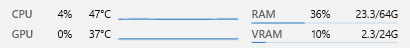 | 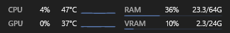 |

| Moving the live widget | No readable space at the chosen position |
| --- | --- |
| 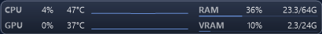 | 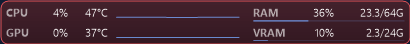 |

| Larger text at 200% scale | Windows high-contrast colors |
| --- | --- |
| 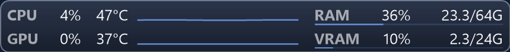 | 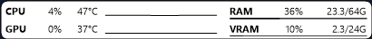 |

Unavailable readings stay visible as `--`. A graph leaves a gap when there is
no valid sample.
If collection stops, readings become unavailable after five seconds or three
configured update intervals, whichever is longer. History continues to age out;
the next fresh sample restores the readings, including in move mode.


## Adaptive layouts

Adaptation is automatic on the selected taskbar. The mod measures the free gaps
between visible controls, the taskbar height and text in the configured font.
Opening more apps, changing Search or Widgets, changing the font, or moving to a
taskbar with different dimensions can change the result. Screen resolution alone
does not determine the layout.

| Layout | What stays visible | When it is used |
| --- | --- | --- |
| **Full, two rows** | CPU/GPU usage, temperatures and graphs; RAM/VRAM percentages, capacities and bars. | The full view fits, including readable shrinking or tighter row spacing. |
| **Without graphs, two rows** | All numeric readings and memory bars. | The full view cannot fit, but removing graphs leaves enough room for the numeric details. |
| **Compact, two rows** | CPU/GPU usage and temperatures; RAM/VRAM percentages. | Removing memory capacities and bars makes two rows fit. |
| **Compact, one row** | The same essential readings, ordered CPU, GPU, RAM, VRAM. | The panel is too low for readable two-row layouts and a wider single row fits. |

| Full, two rows | Without graphs, two rows |
| --- | --- |
| 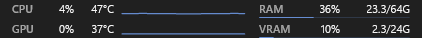 | 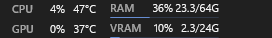 |

| Compact, two rows | Compact, one row |
| --- | --- |
| 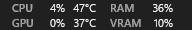 |  |

| Compact two rows in the light theme | Compact one row in the light theme |
| --- | --- |
| 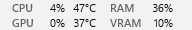 |  |

The compact examples above use 30- and 20-logical-pixel taskbar heights. These
are example dimensions, not fixed switching thresholds. The single row needs
more horizontal space than the compact two-row layout. A narrow gap on a normal
height taskbar can therefore use two rows, while a low panel with a wider gap
can use one.

The normal full layout is tried first. It can shrink to 85% of its size while
keeping the main font at least 9 logical pixels. If it cannot fit or its cells
are too small for the configured font, the mod tries a measured full layout,
then no graphs, compact two rows and compact one row at the configured font size.
Two-row layouts reduce vertical gaps before reducing row height. If needed,
compact layouts can also shrink, keeping the main font at least 9 logical pixels.
If no readable layout fits, the normal widget hides. In move mode, the frame
turns red and the position cannot be saved.

Hidden details still update. Graphs keep collecting history while hidden and
return with its actual age. When room becomes available again, the mod restores
the full view and preferred position. Adaptation does not overwrite **Widget
width**, **Left offset** or positions saved by dragging. **Widget width** is a
preference for the full view; it does not cap the measured width of an adaptive
layout that fits at the configured font size.

While dragging between taskbars, the preview uses the destination's free space,
height and DPI. It can change layout during the drag while keeping the grabbed
point under the cursor. **Enter** checks the current layout again before saving.

## Moving and saved positions

Press **Ctrl+Alt+M** to enter move mode. Grab the widget with the hand cursor and
drag it where you need it. The readings and graphs keep updating while you move.
The original widget is hidden during editing and returns when you cancel.
The normal widget has no glass background. Glass appears only while you hold the
mouse button and drag. After release, the background clears and a thin outline
marks the pending position until Enter or Esc. Hover alone does not add glass.

The frame snaps to a place that can fit the widget. Full size and readable text
take priority over distance. If there is no usable place, it turns red. Releasing
the mouse keeps the preview there, so you can check the position before saving it.

| Key | What it does |
| --- | --- |
| **Enter** | Checks the current taskbar layout again and saves a valid position. A red position cannot be applied. |
| **Esc** | Cancels editing and keeps the previous position. |
| **Home** | Prepares a return to **Taskbar monitor** and **Left offset**. Press Enter to confirm or Esc to cancel. |

Clicking another application, changing settings, changing the display setup or
unloading the mod also cancels editing. The widget and reserved button space
move only after confirmation. A failed move or storage write keeps the previous
saved position.

You can change **Move widget hotkey**. It accepts Ctrl, Alt, Shift or Win with
one letter, digit or F1-F24. Leave it empty to disable the shortcut. An invalid
or already registered shortcut is not registered; the Windhawk log gives the
reason.

Positions are saved separately for each display in Windhawk's local mod storage.
The display is identified by its device path, so its Windows display number can
change without replacing the saved target. The horizontal position is stored
as a fraction of the current layout's available travel width.

Before the first confirmed drag, **Taskbar monitor** and **Left offset** choose
the target. Changing **Taskbar monitor** restores the display choice from settings.
Changing **Left offset** clears the dragged position for the current display.
Other settings keep the saved positions. **Home**, then **Enter**, clears all
positions saved by dragging and returns control to the monitor/offset settings.

If the selected display disconnects, the widget temporarily uses the primary
taskbar. Its saved profile stays intact. When the display returns, the widget
returns to it too.

## Placement and spacing

Placement uses the visible hit areas of Start, Search, Task View, Widgets/weather,
app buttons, overflow, the tray and clock. An empty or stretched background
container does not count as occupied space. Other bounded XAML buttons can also
be included in the map.

The widget keeps at least six logical pixels clear of mapped controls and the
taskbar edges. It also has six logical pixels of inner side padding. These gaps
scale with the display, so the widget does not sit against the next button.

The nearest place for the full width is preferred. When shrinking is necessary,
the widest usable gap is preferred before distance. The widget chooses a readable
layout for that gap and the taskbar height; see [Adaptive layouts](#adaptive-layouts).
Compact cells reserve room for maximum readings and unavailable placeholders, so
changing values do not move the columns.

**Reserve space before the Start button** adds a placement option before the
Start/app group. Existing margins are kept. If the arranged buttons would
collide with another mapped element, the reservation is undone and the mod uses
a free gap. **Reserved space gap** defaults to 8 logical pixels, with an effective
minimum of 6. The mod does not reorder individual app buttons.

Left and centered taskbar alignment use the same placement map. Separately drawn
items or windows from another taskbar mod may need manual positioning or a
compatibility fix. A particular Taskbar Styler preset still needs a live check.

## Metrics and alerts

- CPU usage comes from Windows Processor Utility when available, with
  `GetSystemTimes` as the fallback.
- GPU usage and memory usage come from Windows performance counters. Adapter
  identity and memory capacity come from D3DKMT, with DXGI as the fallback.
- RAM usage and capacity come from Windows memory status.
- Temperatures come from HWiNFO or the Windows/driver interfaces listed below.

CPU and GPU graphs use a fixed 0-100% scale. History defaults to 60 seconds and
can be set from 15 to 180 seconds. Readings default to a one-second interval;
the supported range is 1-10 seconds. Missing samples leave gaps instead of
joining unknown readings. Memory capacities use GiB, shown as `G` in the widget.
Small or fractional totals keep one decimal place.

| Reading | Warning | Critical |
| --- | ---: | ---: |
| CPU temperature | 75°C | 85°C |
| GPU temperature | 80°C | 90°C |
| RAM and VRAM | 80% | 90% |

A small release margin stops alerts flickering around a threshold. CPU and GPU
usage stays in the normal text color, including short 100% spikes.

The GPU with the most dedicated VRAM is selected by default. Use **GPU adapter
filter** for another card. Usage, memory and native GPU temperature are matched
to the selected live adapter.

**GPU memory type** normally stays on **Automatic**. Integrated GPUs use the
Windows shared-memory limit; discrete GPUs use dedicated VRAM. Shared memory is
backed by system RAM and is not a fixed VRAM chip capacity. If a driver or an
older low-memory card is detected incorrectly, set the memory type explicitly.

The mod reads system information. It does not control clocks, fans, power limits
or GPU settings. It does not collect network/disk activity, send telemetry or
make internet requests.

## Temperature providers

**Automatic** fills CPU and GPU temperatures separately. It tries HWiNFO Shared
Memory, then HWiNFO Gadget Registry, then the Windows fallback for any temperature
that is still missing.

| Temperature source | What it reads |
| --- | --- |
| **Automatic** | HWiNFO first, then Windows/driver readings for missing temperatures. |
| **HWiNFO automatic** | Shared Memory, then Gadget Registry. |
| **HWiNFO Shared Memory** | `Global\HWiNFO_SENS_SM2` only. The shared-memory interface targets HWiNFO 7.0 or newer. |
| **HWiNFO Gadget Registry** | `HKCU\Software\HWiNFO64\VSB` only. HWiNFO and Explorer must use the same Windows user. |
| **Windows native** | GPU temperature from the selected display driver through D3DKMT; CPU fallback from Windows ACPI thermal zones through PDH. |
| **Disabled** | Skips temperature collection. Usage, memory and graphs keep working. |

Windows thermal zones can describe a motherboard, chassis, skin or
processor-related sensor. They are not always the CPU package temperature.
**Windows thermal zone filter** selects matching zone names. **Windows thermal
zone aggregation** uses their average by default, or the hottest zone if selected.
The Windows CPU fallback stays unavailable if the system exposes no thermal zones.

HWiNFO is optional and is not bundled with the mod. Automatic CPU matching
prefers `CPU (Tctl/Tdie)`, `CPU Die (average)` or `CPU Package`; GPU matching
prefers `GPU Temperature` for the selected adapter. On a multi-GPU system, use
the adapter and temperature filters if automatic matching picks the wrong sensor.
If Windows has never supplied an adapter identity and no adapter filter is set,
HWiNFO uses its generic GPU-temperature match.

An unavailable reading shows `--°C`. An old temperature is not kept as a current
reading. One missing provider does not stop the other metrics.
Shared Memory readings expire when HWiNFO's poll timestamp stops advancing or is
already too old. The limit allows three HWiNFO polling periods plus two seconds
of slack, with a five-second minimum. Automatic then tries the remaining sources.
Gadget Registry readings expire after 60 seconds without a key write. Registry
has no polling heartbeat, and HWiNFO skips writes when exported values do not
change, so an unchanged key may also expire while HWiNFO is running. Automatic
then tries the remaining sources; missing temperatures in HWiNFO-only modes
show `--°C`.
Use Shared Memory when constant temperatures must remain available. A new
Registry write restores readings, even if the selected temperature is unchanged.

## Setting up HWiNFO temperatures

Use HWiNFO when Windows cannot supply the temperature you want, or when you want
its CPU package sensor. Keep HWiNFO running. **Sensors-only** mode is enough.

### Shared Memory

1. Open HWiNFO **Settings**.
2. Under **General / User Interface**, enable **Shared Memory Support**.
3. Start or reopen the Sensors window.
4. Keep the mod on **Automatic**, or select **HWiNFO Shared Memory** to use only
   that interface.

The non-Pro HWiNFO64/ARM64 edition disables Shared Memory after 12 hours of
continuous use. Re-enable it manually, use Gadget Registry, allow the Windows
fallback, or use Pro. This limit belongs to HWiNFO; the mod does not bypass it.
See [HWiNFO's license comparison](https://www.hwinfo.com/licenses/).

### Gadget Registry

1. Open the Sensors window and **Sensor Settings**.
2. Open the **HWiNFO Gadget** tab and enable gadget reporting.
3. Mark the CPU and GPU temperature readings for **Report to Gadget** reporting
   (the sensor checkbox may be labelled **Report value in Gadget**).
4. Run HWiNFO and Explorer under the same Windows user.
5. Keep the mod on **Automatic**, or select **HWiNFO Gadget Registry**.

The [HWiNFO author's setup note](https://www.hwinfo.com/forum/threads/hwinfomonitor-version-confusion.9300/)
explains the Gadget tab and the registry location. If the wrong sensor is chosen,
set **CPU temperature sensor filter** or **GPU temperature sensor filter** to a
distinctive part of its HWiNFO name. Otherwise, leave the filters empty.

## Settings reference

### Layout and sampling

| Setting | What to change |
| --- | --- |
| **Widget width** | Preferred full-layout width, including side padding. Range: 330-800 logical pixels; default: 410. Adaptive layouts use their measured size within the available space. |
| **Left offset** | Preferred horizontal position before dragging. Nonnegative logical pixels; default: 10. |
| **Taskbar monitor** | Initial display, range 1-32. Monitor 1 is primary; the rest follow their position in the virtual desktop and may differ from Windows numbering. |
| **Move widget hotkey** | Default: `Ctrl+Alt+M`. Empty disables it. |
| **Reserve space before the Start button** | Allows the button group to shift when a safe reservation fits. Off by default. |
| **Reserved space gap** | Gap after a reservation. Range: 0-100 logical pixels; default: 8; effective minimum: 6. |
| **Update interval** | Collection interval, 1-10 seconds; default: 1. |
| **Graph history** | CPU/GPU history, 15-180 seconds; default: 60. |

### Appearance

| Setting | What to change |
| --- | --- |
| **Font size** | Range: 9-13 logical pixels; default: 11. |
| **Font family** | Default: Segoe UI Variable Text. Keep a compact font or increase the widget width. |
| **Adapt colors to the taskbar theme** | On by default. Follows light, dark and Windows high-contrast colors. |
| **Text color** | Manual text color when adaptive colors are off. Empty uses the system color. |
| **Graph and bar color** | Manual color for CPU/GPU graphs and RAM/VRAM bars. |
| **Warning color** | Manual color for warning readings. |
| **Critical color** | Manual color for critical readings. |
| **Text opacity** | Default: 96%. Labels are slightly dimmer; high contrast keeps important content fully visible. |

### Alerts and sensors

| Setting | What to change |
| --- | --- |
| **CPU temperature warning** | Default: 75°C. |
| **CPU critical temperature** | Default: 85°C. |
| **GPU temperature warning** | Default: 80°C. |
| **GPU critical temperature** | Default: 90°C. |
| **Memory usage warning** | RAM/VRAM warning; default: 80%. |
| **Critical memory usage** | RAM/VRAM critical level; default: 90%. |
| **GPU adapter filter** | Partial Windows adapter name. Empty selects the GPU with the most dedicated VRAM. |
| **GPU memory type** | Automatic, Dedicated VRAM or Shared GPU memory. |
| **Temperature source** | The provider modes listed above; default: Automatic. |
| **Windows thermal zone filter** | Partial zone name for the Windows CPU fallback. |
| **Windows thermal zone aggregation** | Average or Hottest; default: Average. |
| **CPU temperature sensor filter** | Partial HWiNFO CPU sensor name. |
| **GPU temperature sensor filter** | Partial HWiNFO GPU sensor name. |

Manual text, graph and alert colors apply when adaptive colors are off. A critical
threshold is kept above its warning threshold. Alerts only change the display.

## Troubleshooting

| What you see | What to check |
| --- | --- |
| Temperature stays at `--°C` | Windows may not expose that sensor. Configure HWiNFO and confirm it is running. Leave Automatic mode on. |
| HWiNFO stops after about 12 hours | Re-enable Shared Memory, use Gadget Registry or let Automatic use Windows readings. |
| GPU temperature belongs to another card | Set GPU adapter filter, then GPU temperature sensor filter if needed. |
| GPU or VRAM stays at `--` after a driver update | Allow up to one minute for adapter refresh or a fresh-counter probe, plus a few samples to establish a baseline. Check the Windhawk log; reload the mod if Windows still supplies no valid readings. |
| Integrated-GPU memory looks too large | Automatic shows the Windows shared-memory limit. Select Dedicated VRAM only if you want the reserved carve-out. |
| An old 512 MB discrete card is shown as shared | Set GPU memory type to Dedicated VRAM. Automatic detection can mistake an old low-memory card for an integrated GPU. |
| Graphs or memory capacities disappeared | The widget selected an adaptive layout. These details return automatically when the free gap or taskbar height allows it. See Adaptive layouts. |
| The widget changed to one row | The selected taskbar is too low for a readable two-row view. One row keeps essential readings when enough width is available. |
| The widget is hidden | The available gap must fit the readability limits and side clearance. Check width, font and the Windhawk log. Try another position or Reserve space. |
| The widget is on the wrong display | Check Taskbar monitor or drag it to the required taskbar. Home, then Enter, clears positions saved by dragging. |
| The hotkey does nothing | Check Move widget hotkey and the log. Choose another combination if it is invalid or already registered. |
| The move frame turns red | The target has no ready taskbar or no readable space. Move to a usable area before pressing Enter. |
| Another taskbar mod overlaps it | Only discoverable XAML bounds are mapped. Custom drawing or separate windows may need a different position or a compatibility fix. |

The Windhawk log records provider changes, adapter selection, counter recovery,
placement errors and sensor mismatches. It does not print every sample.

## Compatibility

The current source is **1.7.0**, built with Windhawk **1.7.3** for Windows 11.
The widget targets horizontal primary and secondary taskbars. x64 and ARM64
builds pass; ARM64 hardware has not been checked.

Placement and editing pass isolated XAML/Win32 tests. Live Explorer checks for
this version are still pending, including top/bottom taskbars, physical moves
between monitors with different DPI, unplug/reconnect, restart persistence and
Taskbar Styler presets. Test renders do not prove those configurations.

The normal widget uses native taskbar XAML. Move mode uses a temporary Win32
window. It does not use XAML Diagnostics. Display changes recheck the target even
when the number of monitors stays the same. Wider fonts need more free space and
can select a compact layout or hide the widget if no readable layout fits.

## Install

Search for **Taskbar System Info** in Windhawk and select **Install**.
To use this repository's source directly:

1. Open Windhawk and select **Create a new mod**.
2. Replace the generated source with [taskbar-system-info.wh.cpp](taskbar-system-info.wh.cpp).
3. Select **Compile Mod** and enable it.

## Development and verification

Run from PowerShell:

```powershell
python .\tests\validate-source.py
.\build.ps1
.\build.ps1 -Architecture aarch64 -OutputDirectory .\build-arm64
.\tests\run-metrics-smoke.ps1
.\tests\run-regression.ps1
.\tests\run-ui-smoke.ps1
```

The source validator uses the Python standard library. Builds use the compiler
and architecture-specific engine library bundled with Windhawk.
VS Code uses `.vscode/c_cpp_properties.json` for C++23 IntelliSense with Windhawk's
Clang compiler, headers and Windows/mod defines. It expects Windhawk under
`%ProgramFiles%\Windhawk`; adjust `compilerPath` and `includePath` for a custom
installation. Python validation supports strict type checking.

The regression suite includes the production module with fake provider APIs and
Windhawk storage. Its checks cover graph gaps, sampling deadlines, HWiNFO
reordering, sparse registry entries, locale-independent numbers, GPU-query
recovery, placement, spacing, hotkeys, saved profiles, cancellation and rollback.
It includes 100,000 generated placement/serialization/confirmation cases and
invalid-engine recovery with a separate, delayed rate-counter probe.
Native callbacks run on private hidden windows.

The XAML smoke test renders the real widget into an isolated XAML Island. It
checks transformed and hidden controls, stretched containers, shrinking and
restoration, external margins, reservation rollback, stable layout and geometry
cache reuse. Move checks include real alpha upload to a hidden layered window,
live readings during dragging, glass only during an active drag, the transparent
normal widget, the hand cursor, red invalid feedback, compact
cells at font size 13, text alignment, opacity restoration and graphics cleanup.
It also checks all four adaptive layouts across 20/24/30/38/48-DIP heights,
different free widths and fonts 9/11/13, including maximum values, stable layout
reuse and matching native previews at 100-200% DPI. Adaptive PNGs include dark,
light and simulated Windows contrast palettes. Another 200,000 generated
geometries use measured XAML/GDI+ font metrics to verify confirmed placement.
A reserved compact placement is
applied, verified, persisted in process-local storage and reloaded without
changing its layout or position. Its PNGs are written to
`build-ui-smoke`; selected images are copied into `assets`. Files starting with
`documentation-` use the workstation readings shown above. The separate boundary
renders retain maximum test values, including 200°C and 1024 GiB; they are not
used in the screenshot gallery.

These isolated checks do not inject Explorer, change desktop DPI or prove a
physical move between monitors with different taskbar heights.

The metrics smoke test reads live Windows counters and adapter interfaces. It
checks adapter selection, counter identity, ranges and available thermal zones.
It checks both the array status and each matching value's `CStatus`; injected
engine failures must exit with code 5. Missing engine instances count as idle
0% only when the selected adapter's memory counter supplies a valid reading.
It does not simulate a driver replacement or a physical monitor change.

Collection runs on a worker thread and the UI consumes completed snapshots. CPU
and GPU queries are separate, so GPU recovery does not reset CPU readings.
Graphs use timestamps; a bounded queue keeps the latest 256 samples when the UI
is busy. Sampling uses deadlines rather than adding collection time to every
interval. Theme, layout and display notifications update the widget; its fallback
UI timer follows the configured sampling interval.

The normal GPU adapter refresh interval is 60 seconds. A changed LUID or
three consecutive hard counter errors can rebuild the GPU query, with a recovery
cooldown. Missing memory readings also trigger a separate fresh-query check;
only a working fresh reading replaces a stale query. Three consecutive samples
with matching but invalid engine values and working memory start a fresh engine
probe. Its baseline and rate sample are collected on separate worker ticks,
at least one update interval apart; only a valid rate triggers recovery. Fresh
probes are limited to one per minute, and invalid values never count as idle.
A parked or unavailable GPU is not repeatedly reset. CPU and RAM stay visible while GPU counters establish
a new baseline. Missing engine and memory readings show `--%`; a valid memory
reading with no engine instances can show idle 0%.

Native GPU-temperature errors have their own retry path. Unsupported or invalid
temperature queries retry once per minute; other failures back off from 5 to 60
seconds. A fresh temperature handle allows recovery even if the adapter LUID
stays the same. A new LUID or settings reload clears the delay. HWiNFO caches
check sensor identities; reordered readings are reselected in the same sample.
Partial discovery retries briefly before returning to the normal 60-second
Shared Memory or 30-second Registry scan. Invalid layouts are rejected and
logged. Shared Memory freshness is checked before copying sensor tables;
expired publications skip the copy and discovery resumes when polling returns.
Registry write times are checked before and after reading to reject concurrent
changes. Numeric parsing and displayed decimals do not depend on Explorer's locale.

See [the 1.7.0 release notes and verification](docs/releases/1.7.0.md),
[the placement verification record](docs/placement-verification-2026-10-04.md)
for the checks and remaining Explorer scenarios, and
[the metrics review record](docs/review-resolution-2026-09-17.md) for provider
behavior and tradeoffs. Automated checks do not replace live hardware tests.

## Contributing and support

See [CONTRIBUTING.md](CONTRIBUTING.md) for development checks and pull requests,
[SUPPORT.md](SUPPORT.md) for setup questions and bug reports, and
[SECURITY.md](SECURITY.md) for reporting suspected vulnerabilities.

## Credits and license

Taskbar discovery and thread dispatch follow
[Multirow taskbar for Windows 11](https://github.com/ramensoftware/windhawk-mods/blob/main/mods/taskbar-multirow.wh.cpp)
by Michael Maltsev (`m417z`). Native GPU temperature collection follows his
[Taskbar Clock Customization implementation](https://github.com/m417z/my-windhawk-mods/commit/861920df6380f4c13abec5d9226362c4725e8362).
Secondary-taskbar discovery is adapted from
[Taskbar Fluent Media Player](https://github.com/Salyts/Taskbar-Fluent-Media-Player)
by Salyts.

Released under [GPL-3.0](LICENSE).
